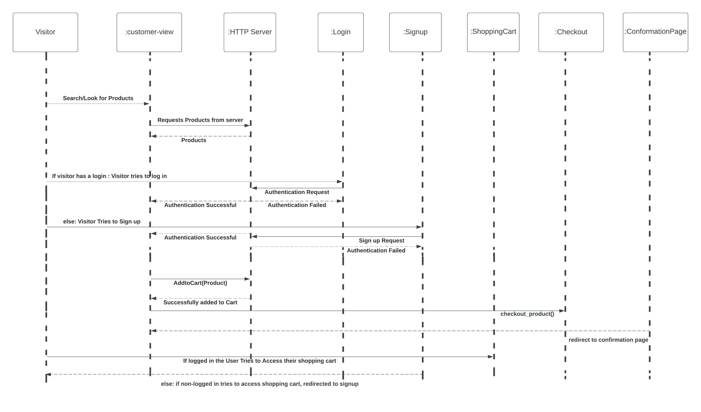

# PROJECT Design Documentation

## Team Information
* Team name: awesome blasters
* Team members
  * Thomas Garcia
  * Aagman Relan
  * Ivan Lin
  * JianZhuang Jiang

## Executive Summary

Our website must allow signed in users to add products to their shopping
cart and checkout said items utilizing our UI to navigate throughout the website.

The webiste we are creating should allow a user to sign up to a new account or log into an existing account to add a product our company is offering in their shopping cart and then proceed to purchase said product if they wish at checkout.

### Purpose
Rochester Parkour is family run gym and fitness center situated in downtown Rochester. Our goal is to encourage individuals to partake in physical activties to better themselves physically, and mentally. We have been serving our community since 1980's. The target audience for this business is anyone who wants to work on themselves.
This document describes the features and functionality of our newly developed Web application. 

### Glossary and Acronyms

| **Term** | **Definition**                                           |
|----------|----------------------------------------------------------|
| Visitor  | A Person on the website who is not logged in             |
| User     | A person on the website who is logged in                 | 
| Admin    | This person can manage products and users of the website |

## Requirements

## Definition of MVP
* The admin should be able to Add/Remove/Modify the products offered at the Estore
* Visitors can sign up and login as users of the website
* Users can add or remove products from their shopping cart.
* Users can checkout their shopping carts.

### Roadmap of Enhancements
* User Rating: The user should be able to add ratings for the products and leave a review for the products necessary (added in Sprint 3)
* View Typed Password: Visitor should be able to view the typed password when signing.

## Application Domain

The Admin/Parkour gym maintains the Products that the store seliing. Admin/Parkour gym also validate visitors when they try to login or sign up. If the validation is successful they are either logged in as an existing user or a brand new user. The user has the ability search and add/remove products to/from their personal shoppping cart. Users can then checkout their shopping cart. A user can look at the various products and choose to add to add them to the shopping cart or/and leave a review. A visitor to the store can only view the products and read their descriptions. Until the visitor signs up, the visitor is not allowed to put items in the cart or leave a review on the products. The visitor can become a user by signing up or by logging in.

## Architecture and Design

This section describes the application architecture.

### Summary

The following Tiers/Layers model shows a high-level view of the webapp's architecture.

The e-store web application, is built using the Model–View–ViewModel (MVVM) architecture pattern. 

The Model stores the application data objects including any functionality to provide persistance. 

The View is the client-side SPA built with Angular utilizing HTML, CSS and TypeScript. The ViewModel provides RESTful APIs to the client (View) as well as any logic required to manipulate the data objects from the Model.

Both the ViewModel and Model are built using Java and Spring Framework. Details of the components within these tiers are supplied below.

The data is stored in JSON files

### Overview of User Interface

This section describes the web interface flow; this is how the user views and interacts
with the e-store application.

> Once a user visits the home page of the e-store they are greeted with a
> big picture and in the middle of their screen and only have a 
> navigation >bare to guide them throughout the website. Any user is able 
> to view >products but in order to purchase them they need to be logged 
> in, users >will be redirected to login/signup page if they try to add 
> an item to >their shopping cart. The navigation bar makes traversing 
> through the e-store simple as everything is very straightfoward/ one 
> dimensional.  

### View Tier
> There is an admin view which only the owner of the e-store can have access to via credentials and they have the abilities to add, update and remove items as they please.
> There is a customer view where they don't have the abilities to update/add/ and remove items such as the admin and the only thing they can do is 
> login/signup and add items to their shopping cart only if they are logged in to then purchase.

### ViewModel Tier
> The sequence diagram above gives a good idea about how the view model 
> works for the customer since it divides what permissions they have/ 
> actions they can do if they are logged in or if they aren't logged in
> at all. The only thing missing is a admin tier but they only things an 
> admin can do that a customer can't do is have the ability to add/remove/
> update items so there would be special methods like add() remove() or 
> update() that they would have an they would have a special username/
> password for their attribute since their credentials are unique.

### Model Tier
> The model Tier is where we define our data classes. We have a class 
> for all the entities we use within this application.
>
> Product: The product class defines the attributes of a product hosted on the estore.
> User: The User class defines the attributes of the user who signs up on the estore. Along with personal information
>       each user has a shopping cart so that they can resume their shopping where they left it.
> Rating: The rating class defines the structure of a rating. Users can leave a rating for any of the products that
>         they like.
> ProductRating: This is wrapper class that keeps a product and its associated rating together in one object
> UserLogin: This is class to accomodate a temporary object, when the user submits the login form. The data is packed 
>            together in a UserLogin object before getting passed on to the server.

### Static Code Analysis/Design Improvements
> When it came to the static code analysis the only time we ran it was
> the first time and the only issue we had with that at the time was the 
> code coverage since we didn't test out the new functions/ 
> implementations we did to our backend.
> Improvements to make if the project were to continue:
> 1)Time management so we can avoid working on the project last minute
> 2)Checking out the merge request and trying to run it on our own 
> machines, instead of only reviewing the code in the merge request.
> 3) Updating the trello board in a manner which outlines our project 
> plans more effectively and be more specific about features/ goals we 
> have in mind for the project.

## Testing

### Acceptance Testing
> Most of our user stories have passed with minimal bugs the only issue 
> is that we missed the target on 1 or 2 stories where it was supposed to 
> be our MVP feature such as searching for a product which will be 
> targeted in the final sprint. In addition to this we have a current 
> issue where a product being removed from a user's shopping cart isn't 
> removed instantly and has a delay but we don't know exactly how this
> happens so we will also work on this bug in the final sprint.

### Unit Testing and Code Coverage
> Our estore api controller, persistence, and model have high code  
> coverage since there was a lot of testing done on the backend to make 
> sure they are as little bugs as possible. There is one file where the 
> code coverage came at 0% due to it only being one function and thats 
> simply opening up the server.

## Design Principle Analysis
> One of the design principles we followed was the Design by contract principle.
> Via our domain model and sequence diagram we have determined the interactions 
> made by certain components and this is especially evident in the sequence diagram
> where we see the http client making obligations to provide benefits to the clients.
> An example of this is where the client would sign in to an existing account they 
> created and the http server is required to make an obligation such as giving the 
> signed in user the ability to add an item to their shopping cart and being able to
> check it out. The second design principle we followed was Open/Closed principle. 
> This principle is evident in our Users Class since we don't need to modify the 
> class itself to make room for a new user signing up to the estore (closed for
> modification) but it is open for extension. In other words, an entity can allow 
> its behaviour to be extended without modifying its source code. The final design
> principle that was followed in our project is the Pure Fabrication principle since 
> our project has a Persistence class which doesn't represent any domain entity 
> unlike other classes which do in our domain model. The purpose of this class is to 
> handle data storage functions.